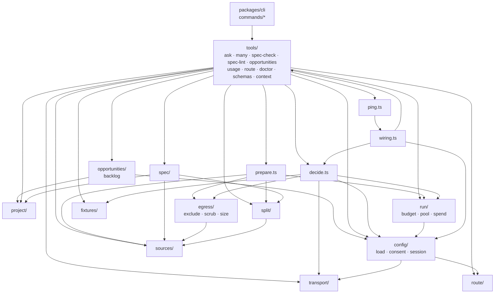

# Building blocks of the engine

The modules of `packages/core/src`, what each owns, and which depends on which, so you know where a
change goes. The public surface is `packages/core/src/index.ts`; the CLI reaches it through that
barrel, except on its startup path (below).

## Module map

Edges are imports, read from the source files. `model/` (types, profiles, validation) and
`errors.ts` are imported by nearly every module, so edges into them are left out.

Two things the picture shows that are easy to miss. `config/load.ts` imports `route/` for
`ROUTE_DEFAULTS` and `transport/` for the default endpoint and timeout, so config sits above them
rather than at the bottom. And `tools/doctor.ts` → `ping.ts` → `wiring.ts` → `tools/context.ts` is
an import cycle. It works because none of those modules uses another's exports while loading, so
keep load-time code out of that loop.

## tools/: the only surface the CLI calls

Each tool is a TypeBox input schema in `tools/schemas.ts` (`TOOL_SCHEMAS`, printed by
`decide schema <tool>`) and a handler: `runAsk`, `runMany`, `runSpecCheck`, `runUsage`, `runRoute`
and `runDoctor`. Schemas refuse unknown properties
([0015 § Egress and input rules](../../plans/decisions/0015-cli-contract-v1.md#egress-and-input-rules-tightened-in-m6-after-the-review)).

`tools/context.ts` is the wiring every decision tool shares:

- `createContext()` loads config once per invocation and resolves the spec directories.
- `checkInput()` validates raw input against the tool's schema and reports every problem.
- `resolveRequest()` merges a spec's defaults with explicit input, re-anchors command-line paths
  from the working directory to the repo root, and resolves the model profile.
- `deciderFor()` builds the decider: a transport only when a key is set, consent from the repo
  layer, fixtures and ledger under `<repo>/.system1/`, and replay forced by `SYSTEM1_REPLAY`.

`runRoute` deliberately skips the context and TypeBox (it checks its one field by hand), because
the Claude hook runs it on every prompt.

The CLI side (`packages/cli/src`) only maps argv to a tool input (`args.ts`), calls the handler
through `emit()` (`run.ts`), and renders `json`, `jsonl` or `brief` (`format.ts`). A new tool
starts in `tools/`, and the CLI gets a thin command for it. `main.ts`, `run.ts` and
`commands/route.ts` import the deep exports `@garygentry/system1-core/errors`, `/version` and
`/route` rather than the barrel, so `version`, `help` and the hook never load TypeBox or the source
readers. Keep that path lean: `pnpm bench:startup` holds it to the target
([quality.md](quality.md#live-and-local)).

## Input side

- **`sources/`** reads `glob`, `file` (with an optional line range), `jsonl`, `diff`, `text` and
  `stdin` into documents (`sources/read.ts`). It honours `.gitignore`, resolves symlinks, withholds
  anything outside the repo unless `allowOutside`, and reports every skip with a reason
  (`binary`, `too-large`, `gitignored`, `excluded`, `outside-repo`, and `filtered` for `--exclude`).
- **`split/`** turns documents into items, one call each: `file`, `hunk`, `row`, `lines:N[/overlap]`
  and `join` (everything as one state).
- **`spec/`** parses and validates saved specs (`SpecSchema`), resolves a name through repo, user
  and bundled directories, and parses `expect` answers for `spec check` (`spec/expect.ts`).
- **`config/`** layers config (`load.ts`), reads and writes consent (`consent.ts`), and detects
  the harness session (`session.ts`). See
  [crosscutting.md](crosscutting.md#config-layering-and-secrets).

## The egress gate

`prepare.ts` is the one path from sources to sendable items: read → exclude → scrub whole
documents → split → exclude again → scrub each item → size-check each item → cost projection. It
makes no network call. The pieces live in `egress/`:

- `exclude.ts`: `DEFAULT_EXCLUDES` (keys, `.env*`, credentials files and similar), which config can
  add to but not remove. Matched against the given path and the resolved one.
- `scrub.ts`: redacts secret-shaped text and credential-named fields in structured data.
- `size.ts`: a deliberately conservative estimate (3 characters per token). An oversized item is
  refused with `state-too-large`, never truncated.

`decide.ts` repeats the scrub and the size check just before the wire, so a caller using the
library directly cannot skip them. See [runtime.md](runtime.md#where-each-guarantee-lives).

## Deciding

- **`decide.ts`** builds a `Decider` in one of four modes: `auto` (live with a key, else replay),
  `live`, `record` (live, and write the fixture) and `replay` (no network; a miss is
  `replay-miss`). It checks consent before any live call and appends every call to the ledger.
- **`model/`**: `profiles.ts` holds the model profiles as data (only `typesafe/jev-1.13`;
  [0003](../../plans/decisions/0003-model-layer-one-transport-data-only-model-profiles.md)),
  `answers.ts` the undecided floor and confidence rules, `validate.ts` the strict checks on
  question sets and responses, `types.ts` the wire types.
- **`transport/openrouter.ts`**: one POST per decision, with a timeout per attempt, up to three
  attempts with doubling backoff on retryable statuses, and strict validation of the body.
- **`fixtures/store.ts`**: content-addressed recorded answers, keyed by the SHA-256 of the
  canonical JSON of `{model, state, questions}`, stored per namespace (a spec name or `adhoc`).

## Output side

- **`run/budget.ts`**: `project()` makes the labelled cost projection (`basis: "projected"`), and
  `checkBudget()` is the spend guard (200 calls or $0.05 by default,
  [0011](../../plans/decisions/0011-default-spend-guard-a-request-above-200-calls-or-0.md)).
- **`run/pool.ts`**: `mapWithConcurrency`, which settles every item rather than failing fast.
- **`run/spend.ts`**: the ledger (`usage.jsonl`) and `sumUsage`, which marks a total containing an
  unreported usage as a lower bound.
- **`project/project.ts`**: the `--keep`, `--sort`, `--limit` and `--fields` projection. Undecided
  rows come out separately and are never thresholded.

## spec/lint.ts and opportunities/

- **`spec/lint.ts`**: the offline `spec lint` checks, over the text of a question set and a spec's
  `keep` and `policy`. `lintStatement` lints one bare sentence (for criteria read from a file).
  `tools/spec-check.ts` runs it too and reports the findings as `lint`.
- **`opportunities/backlog.ts`**: the scout backlog in `.system1/opportunities.json`. Its TypeBox
  schema, the content-derived id, the projected saving (computed, never given), the merge rules
  (update by id, stale by path, a status kept across re-sweeps) and record-field filters. The
  filters share the `--keep` tokenizer with `project/project.ts` but not its evaluator, which is
  about answers and undecided.
- **`sources/filter.ts`**: `--exclude`, applied to glob matches before they're read and to every
  other source after, reported as `filtered`.
- **`model/schema.ts`**: the TypeBox question schema, shared by tool inputs and the backlog.

## route/

`route/route.ts` is prompt matching for the Claude hook, independent of deciding: the built-in
triggers (`BUILTIN_TRIGGERS`), the veto list (`BUILTIN_IGNORE`), and how `route:` config switches
them off or adds to them ([0018](../../plans/decisions/0018-claude-routing-hook.md)). It imports
nothing but `errors.ts`. `config/` imports it for the defaults, `tools/route.ts` runs it, and
`tools/doctor.ts` checks the user's `route:` config with it.

## Loose ends

- `wiring.ts` (`createDeciderFromEnv`, `resolveConnection`) is convenience wiring for scripts and
  tests. `ping.ts` takes its `ConnectionConfig` type, and the CLI's `ping` falls back to
  `resolveConnection` (the environment alone) when a config file fails to load.
- `testkit/` and `testdata/` are test helpers, not part of the published surface.
- `index.ts` exports nearly everything, and nothing documents it for outside use. Whether it is a
  stable API is undecided (M6 D1 published it anyway).
