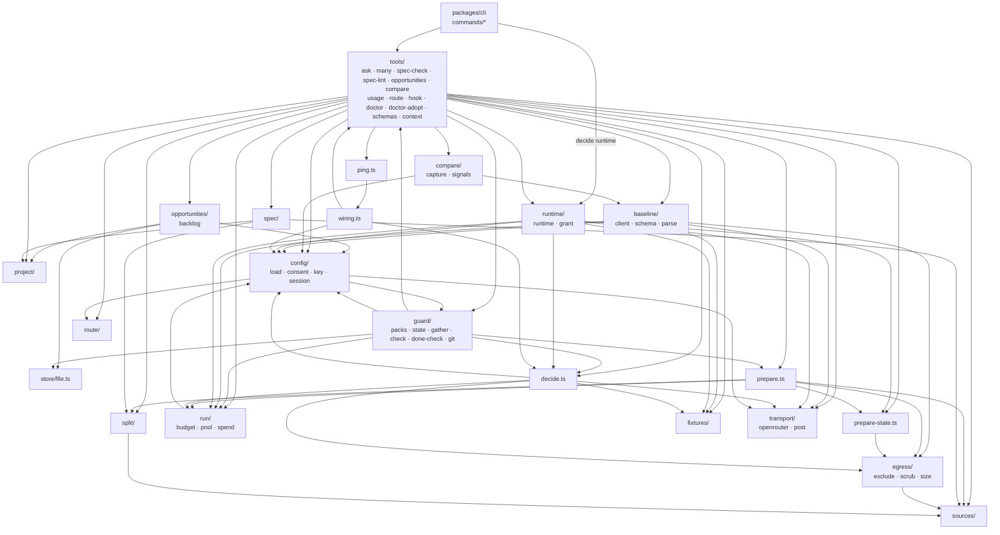

# Building blocks of the engine

The modules of `packages/core/src`, what each owns, and which depends on which, so you know where a
change goes. The public surface is `packages/core/src/index.ts`; the CLI reaches it through that
barrel, except on its startup path (below).

## Module map

Edges are imports, read from the source files. `model/` (types, profiles, validation) and
`errors.ts` are imported by nearly every module, so edges into them are left out.

```mermaid
flowchart TB
    cli["packages/cli<br/>commands/*"]
    tools["tools/<br/>ask · many · spec-check · spec-lint · opportunities · compare<br/>usage · route · hook · doctor · doctor-adopt · schemas · context"]
    runtime["runtime/<br/>runtime · grant"]
    guard["guard/<br/>packs · state · gather · check · done-check · git"]
    comparemod["compare/<br/>capture · signals"]
    baseline["baseline/<br/>client · schema · parse"]
    opps["opportunities/<br/>backlog"]
    store["store/file.ts"]
    prepare["prepare.ts"]
    pstate["prepare-state.ts"]
    decide["decide.ts"]
    spec["spec/"]
    project["project/"]
    config["config/<br/>load · consent · key · session"]
    route["route/"]
    run["run/<br/>budget · pool · spend"]
    egress["egress/<br/>exclude · scrub · size"]
    sources["sources/"]
    split["split/"]
    fixtures["fixtures/"]
    transport["transport/<br/>openrouter · post"]
    ping["ping.ts"]
    wiring["wiring.ts"]

    cli --> tools
    cli -- "decide runtime" --> runtime
    tools --> opps
    tools --> comparemod
    tools --> baseline
    tools --> guard
    tools --> runtime
    opps --> project
    opps --> config
    opps --> store
    tools --> prepare
    tools --> pstate
    tools --> decide
    tools --> spec
    tools --> project
    tools --> config
    tools --> run
    tools --> split
    tools --> sources
    tools --> fixtures
    tools --> transport
    tools --> route
    tools --> ping
    guard --> tools
    guard --> prepare
    guard --> decide
    guard --> run
    guard --> store
    guard --> config
    comparemod --> baseline
    comparemod --> config
    baseline --> config
    baseline --> egress
    baseline --> fixtures
    baseline --> transport
    baseline --> run
    runtime --> decide
    runtime --> pstate
    runtime --> fixtures
    runtime --> run
    runtime --> transport
    runtime --> config
    prepare --> sources
    prepare --> split
    prepare --> egress
    prepare --> run
    prepare --> pstate
    pstate --> egress
    decide --> config
    decide --> egress
    decide --> fixtures
    decide --> run
    decide --> transport
    spec --> project
    spec --> sources
    spec --> split
    config --> route
    config --> transport
    config --> guard
    run --> config
    egress --> sources
    split --> sources
    ping --> wiring
    wiring --> tools
    wiring --> decide
    wiring --> config
```

Things the picture shows that are easy to miss:

- `config/load.ts` imports `route/` for `ROUTE_DEFAULTS`, `transport/` for the default endpoint and
  timeout, and `guard/packs.ts` for the packs' defaults, so config sits above them rather than at
  the bottom.
- `tools/doctor.ts` → `ping.ts` → `wiring.ts` → `tools/context.ts` is an import cycle, and so is
  `guard/` ↔ `tools/` (`guard/check.ts` builds its decider through `tools/context.ts`, and
  `tools/hook.ts` loads `guard/done-check.ts`). They work because none of those modules uses
  another's exports while loading, so keep load-time code out of those loops.
- `runtime/` reaches `decide.ts` but not `tools/`, `prepare.ts` or the config loader (it imports
  only `config/key.ts`, to unquote a key). That is what lets it run in an app with no repo config,
  and why `./runtime` loads no source readers.

## tools/: the only surface the CLI calls

Each tool is a TypeBox input schema in `tools/schemas.ts` (`TOOL_SCHEMAS`, printed by
`decide schema <tool>`) and a handler: `runAsk`, `runMany`, `runSpecCheck`, `runSpecLint`, the
`opportunities` handlers (`add`, `list`, `check`, `set-status`), `runCompare`, `runUsage`,
`runRoute` and `runDoctor`. `decide schema` also prints `hook` and `runtime`, the stdin shapes of
the two commands outside the envelope. Schemas refuse unknown properties
([0015 § Egress and input rules](../../plans/decisions/0015-cli-contract-v1.md#egress-and-input-rules-tightened-in-m6-after-the-review)).

`tools/context.ts` is the wiring every decision tool shares:

- `createContext()` loads config once per invocation and resolves the spec directories.
- `checkInput()` validates raw input against the tool's schema and reports every problem.
- `resolveRequest()` merges a spec's defaults with explicit input, re-anchors command-line paths
  from the working directory to the repo root, and resolves the model profile.
- `deciderFor()` builds the decider: a transport only when a key is set, consent from the repo
  layer, fixtures and ledger under `<repo>/.system1/`, and replay forced by `SYSTEM1_REPLAY`. It
  takes an optional ledger `tag` and fixtures directory, which `compare` and done-check use.
- `baselineFor()` builds the emulated baseline's client the same way, adding whether the repo
  allowed that profile (`egress.allowProfiles`). Only `compare` calls it.

`runRoute` deliberately skips the context and TypeBox (it checks its one field by hand), because
the Claude hook runs it on every prompt. `runHook` (`tools/hook.ts`) does the same for the guard
hooks: it loads only the config until a pack is both enabled and consented, and imports
`guard/done-check.ts` only then.

The CLI side (`packages/cli/src`) only maps argv to a tool input (`args.ts`), calls the handler
through `emit()` (`run.ts`), and renders `json`, `jsonl` or `brief` (`format.ts`). A new tool
starts in `tools/`, and the CLI gets a thin command for it. `main.ts`, `run.ts` and
`commands/route.ts` import the deep exports `@garygentry/system1-core/errors`, `/version` and
`/route` rather than the barrel, so `version`, `help` and the prompt hook never load TypeBox or the
source readers. `commands/hook.ts` and `commands/runtime.ts` use `/hook`, `/runtime` and
`/runtime/grant` the same way, and `main.ts` dispatches both before it parses `--format`, because
each reads one JSON object and always exits 0. Keep that path lean: `pnpm bench:startup` holds
it to the target
([quality.md](quality.md#live-and-local)).

## Input side

- **`sources/`** reads `glob`, `file` (with an optional line range), `jsonl`, `diff`, `text`,
  `stdin` and `state` (an in-memory state, added in M11) into documents (`sources/read.ts`). It
  honours `.gitignore`, resolves symlinks, withholds anything outside the repo unless
  `allowOutside`, and reports every skip with a reason (`binary`, `too-large`, `gitignored`,
  `excluded`, `outside-repo`, and `filtered` for `--exclude`).
- **`split/`** turns documents into items, one call each: `file`, `hunk`, `row`, `lines:N[/overlap]`
  and `join` (everything as one state).
- **`spec/`** parses and validates saved specs (`SpecSchema`), resolves a name through repo, user
  and bundled directories, and parses `expect` answers for `spec check` (`spec/expect.ts`).
- **`config/`** layers config (`load.ts`), reads and writes consent, the guard packs' `enabled`
  and `egress.allowProfiles` (`consent.ts`), unquotes and checks a key (`key.ts`), and detects the
  harness session (`session.ts`). `assert-consent.ts` is the one `egress-refused` check, split out
  in M11 so the decider, and with it `./runtime`, doesn't load `consent.ts` and its YAML writer. See
  [crosscutting.md](crosscutting.md#config-layering-and-secrets).

## The egress gate

`prepare.ts` is the one path from sources to sendable items: read → exclude → scrub whole
documents → split → exclude again → scrub each item → size-check each item → cost projection. It
makes no network call. The pieces live in `egress/`:

- `exclude.ts`: `DEFAULT_EXCLUDES` (keys, `.env*`, credentials files and similar), which config can
  add to but not remove. Matched against the given path and the resolved one.
- `scrub.ts`: redacts secret-shaped text and credential-named fields in structured data.
- `size.ts`: a deliberately conservative estimate (3 characters per token). An oversized item is
  refused with `state-too-large`, never truncated.

`decide.ts` repeats the scrub and the size check just before the wire, so a caller using the
library directly cannot skip them. See [runtime.md](runtime.md#where-each-guarantee-lives).

**`prepare-state.ts`** is the state-level entry point (M11): `prepareState(state, {questions,
profile})` checks the question set and the choice limit, scrubs one in-memory state, checks its
shape again, and size-checks it, returning `{state, tokens, redactions}` or `state-too-large`.
It has no path, so excludes can't apply
([0020](../../plans/decisions/0020-runtime-consent-for-adopted-code.md) §2). The runtime and
`compare` use it; it loads no source readers.

## Deciding

- **`decide.ts`** builds a `Decider` in one of four modes: `auto` (live with a key, else replay),
  `live`, `record` (live, and write the fixture) and `replay` (no network; a miss is
  `replay-miss`). It checks consent before any live call and appends every call to the ledger.
- **`model/`**: `profiles.ts` holds the model profiles as data
  ([0003](../../plans/decisions/0003-model-layer-one-transport-data-only-model-profiles.md)):
  `typesafe/jev-1.13` (`transport: openrouter-decisions`) and the emulated baseline
  `emulated:anthropic/claude-haiku-4.5` (`transport: openrouter-chat`, `calibrated: false`). A
  chat-transport profile can come only from the built-in list or the repo file
  (`profileList` in `config/load.ts`).
  `answers.ts` the undecided floor and confidence rules, `validate.ts` the strict checks on
  question sets and responses, `types.ts` the wire types.
- **`transport/post.ts`**: the POST both clients share. A timeout per attempt, up to three
  attempts with doubling backoff on `RETRY_STATUSES`, and an account of what each attempt may have
  cost: `mayHaveRun()` says whether a status could have been billed, a failure that may have been
  carries `spent` (`{usage, uncounted}`), and a caller abort after such an attempt is still an
  `AbortError` but carries `spent` too (`AbortedAfterSpend`). A timeout while reading a 200's body
  is never retried, because a 200 is paid for.
- **`transport/openrouter.ts`**: the decisions transport over `post.ts`, with strict validation of
  the body and `uncounted` on the result for retries billed unreported.
- **`fixtures/store.ts`**: content-addressed recorded answers, keyed by the SHA-256 of the
  canonical JSON of `{model, state, questions}`, stored per namespace (a spec name or `adhoc`).

## The emulated baseline

`baseline/` asks a chat model for the answers a question set asks Jev for, so `compare` can put a
cheap LLM call beside the decision model. It is not a decider and never becomes one.

- **`baseline/schema.ts`**: `schemaFor()` turns the question set into a strict JSON schema, and
  `promptFor()` the prompt (ported from `jev-poc`).
- **`baseline/parse.ts`**: strict parsing into `BaselineAnswer`, a single value per question: a
  noul in 0–1, an integer score level, an offered choice key. Anything else is a counted parse
  failure; nothing is rounded or clamped. `BaselineAnswer` never enters `Answers`, `project()` or
  a threshold.
- **`baseline/client.ts`**: `createBaselineClient()` refuses a profile that isn't
  `openrouter-chat`, needs repo consent and the profile in `egress.allowProfiles` for a live call,
  scrubs and sizes like the decider, sends `provider.data_collection: "deny"`, and records and
  replays its own fixtures (the raw reply, parsed afresh on replay).

## compare/ and tools/compare.ts

- **`compare/capture.ts`** reads `.system1/compare/<spec>/captured.jsonl` and
  `.system1/labels/<spec>.jsonl`. A bad line is reported with its number and left out, never fatal;
  each row's `current` is parsed strictly into the answer space.
- **`compare/signals.ts`** reduces paired answers to signals: agreement by question type,
  decisiveness, the undecided share, cost and latency (`costSignal` marks a missing usage as
  unknown, never zero), accuracy with its `n`, and the head-to-head over labelled answers both
  sides gave, which is the only thing `winner` is decided on.
- **`tools/compare.ts`** (`runCompare`) joins them: prepare each state for both profiles, project
  both sides, check consent, the allow-list and one spend guard over both, fan out, and write
  `report.json`. The engine runs no user code
  ([0014](../../plans/decisions/0014-no-command-source.md)): the shadow harness ran the current
  mechanism before. See [runtime.md](runtime.md#one-decide-compare-run).

## runtime/: the surface for adopted code

- **`runtime/runtime.ts`**: `createPolicyRuntime()`, the `REASON_CODES`, and the daily cap. It
  validates its options once (a bad one makes every call fall back with `internal`), reads the
  module's marked line as a second lock, builds a decider per call with `egressConsent` taken from
  the grant, and never throws. It keeps its own spend ledger under `root`, tagged `runtime`, and
  reads today's runtime spend back from that file at start.
- **`runtime/grant.ts`**: `EGRESS_MARKER`, `grantIn()` (on only when exactly one line carries the
  marker and that line assigns the literal `"on"` at column 0, followed by nothing but the
  marker), and `RUNTIME_PROTOCOL`. `decide runtime`, the runtime's module lock and doctor's
  `adopted` check all read grants through it.
- **`runtime/index.ts`** is the `./runtime` export: `createPolicyRuntime`, `prepareState`, the
  reason codes, `RUNTIME_TAG` and their types, pinned by `runtime/index.test.ts`.

## guard/: the done-check pack

- **`guard/packs.ts`**: the pack table (`PACKS`, today only `done-check`) and its defaults
  (`latencyMs` 5000, `maxUsdPerSession` $0.01, criteria `TASK.md` and `.system1/done.md`,
  `askAboutMessage` off). `enabled` is read only from the repo layer.
- **`guard/state.ts`**: `.system1/guard/state.json`, per harness session: the base commit, the
  criteria files as they were at SessionStart, and the hash of what was last checked, so an
  unchanged re-stop sends nothing. Pruned by age and count, refused (fail open) past 1 MB.
- **`guard/gather.ts`** and **`guard/git.ts`**: the criteria bullets and this session's change
  (diff against the base, untracked files, evidence files), read through `git` only (0014).
- **`guard/check.ts`**: two `noul` questions per criterion, judgeable and met, through `prepare()`
  and `deciderFor()` with the tag `guard:done-check`, under 0011's guard and the pack's per-session
  cap read from the ledger. It blocks only on a criterion confidently judgeable and confidently
  unmet (`DONE_CHECK_THRESHOLDS`, fitted on `tools/done-check-eval`). With `askAboutMessage`, it
  first asks whether the agent's last message waits on the user, and lets a confident yes through.
- **`guard/done-check.ts`**: the pack's `sessionStart` and `stop`, loaded only once the pack is
  active.

## Output side

- **`run/budget.ts`**: `project()` makes the labelled cost projection (`basis: "projected"`), and
  `checkBudget()` is the spend guard (200 calls or $0.05 by default,
  [0011](../../plans/decisions/0011-default-spend-guard-a-request-above-200-calls-or-0.md)).
- **`run/pool.ts`**: `mapWithConcurrency`, which settles every item rather than failing fast.
- **`run/spend.ts`**: the ledger (`usage.jsonl`) and `sumUsage`, which marks a total containing an
  unreported usage as a lower bound.
- **`project/project.ts`**: the `--keep`, `--sort`, `--limit` and `--fields` projection. Undecided
  rows come out separately and are never thresholded.

## spec/lint.ts and opportunities/

- **`spec/lint.ts`**: the offline `spec lint` checks, over the text of a question set and a spec's
  `keep` and `policy`. `lintStatement` lints one bare sentence (for criteria read from a file).
  `tools/spec-check.ts` runs it too and reports the findings as `lint`.
- **`opportunities/backlog.ts`**: the scout backlog in `.system1/opportunities.json`. Its TypeBox
  schema, the content-derived id, the projected saving (computed, never given), the merge rules
  (update by id, stale by path, a status kept across re-sweeps), `set-status` (a `rejected`
  status needs a reason), and record-field filters, all written under the file lock in
  `store/file.ts`. The
  filters share the `--keep` tokenizer with `project/project.ts` but not its evaluator, which is
  about answers and undecided.
- **`sources/filter.ts`**: `--exclude`, applied to glob matches before they're read and to every
  other source after, reported as `filtered`.
- **`model/schema.ts`**: the TypeBox question schema, shared by tool inputs and the backlog.

## route/

`route/route.ts` is prompt matching for the Claude hook, independent of deciding: the built-in
triggers (`BUILTIN_TRIGGERS`), the veto list (`BUILTIN_IGNORE`), and how `route:` config switches
them off or adds to them ([0018](../../plans/decisions/0018-claude-routing-hook.md)). It imports
nothing but `errors.ts`. `config/` imports it for the defaults, `tools/route.ts` runs it, and
`tools/doctor.ts` checks the user's `route:` config with it.

## Loose ends

- `wiring.ts` (`createDeciderFromEnv`, `resolveConnection`) is convenience wiring for scripts and
  tests. `ping.ts` takes its `ConnectionConfig` type, and the CLI's `ping` falls back to
  `resolveConnection` (the environment alone) when a config file fails to load.
- `testkit/` and `testdata/` are test helpers, not part of the published surface.
- `index.ts` exports nearly everything, and nothing documents it for outside use. Whether it is a
  stable API is undecided (M6 D1 published it anyway). `./runtime` is the exception: it is
  documented in [../runtime.md](../runtime.md) and committed under semver (0020 §2).
- `store/file.ts` is the shared file lock (`withFileLock`, which takes over a stale lock) and
  atomic writes, used by the backlog and the guard state.
