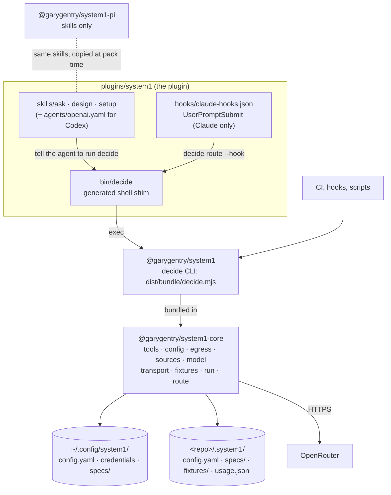

# Containers: plugin, CLI, engine, local state

The deployable units, how each harness reaches the engine, and where state lives on disk. This
replaces the diagram and harness matrix in [ROADMAP § Architecture](../../plans/ROADMAP.md#architecture),
which still show deferred pieces (plugin `specs/`, agents, `decide hook <pack>`).

## The units

| Unit | Source | What it is |
|---|---|---|
| The plugin | `plugins/system1/` | Three skills, the generated manifests (`.claude-plugin/plugin.json`, `.codex-plugin/plugin.json`, `plugin.json`), the `bin/decide` shim and the Claude hook. Installed from the GitHub marketplaces, not from npm. |
| `@garygentry/system1` | `packages/cli` | The `decide` CLI. It ships only `dist/bundle/` (esbuild output with the engine inlined) and `THIRD-PARTY-NOTICES.md`; core is a devDependency. |
| `@garygentry/system1-core` | `packages/core` | The engine as a library. Published beside the CLI (M6 D1), with `index.ts` as its surface and three deep exports (`./errors`, `./version`, `./route`) that keep the CLI's startup path off the barrel. Its stability as a public API is undecided. |
| `@garygentry/system1-pi` | `packages/pi` | Skills only, for `pi install npm:`. Its `package.json` and `prepack.mjs` are generated, and `prepack` copies `plugins/system1/skills` in. |

The four skills are `ask` (hand a closed judgement to `decide`), `design` (save a reusable spec),
`setup` (user-only: install, key, consent, network) and `scout` (user-only: screen code or agent
configuration for decision-model opportunities into a backlog). None ships a spec to the lookup
path: scout's two signal tables sit in its `references/` and are passed to `--spec` by path. The lowest-priority
spec directory (origin `bundled`) is set only by `SYSTEM1_SPECS_PATH`; no package carries one.

## Per harness

What shipped, as generated by `tools/generate.ts` and verified in AGENTS.md's harness notes.

| | Claude Code | Codex | Pi |
|---|---|---|---|
| Manifest | `.claude-plugin/plugin.json` | `.codex-plugin/plugin.json` | root `package.json` `pi` key, or `@garygentry/system1-pi` |
| Marketplace | `.claude-plugin/marketplace.json` | `.agents/plugins/marketplace.json` | none: `pi install npm:@garygentry/system1-pi` or `git:` |
| Skills | `plugins/system1/skills/` | the same | the same, copied into the Pi package |
| User-only `setup` | `disable-model-invocation: true` | `agents/openai.yaml` `allow_implicit_invocation: false` | `disable-model-invocation: true` |
| How `decide` is found | plugin `bin/` is on the Bash PATH, so the shim runs | not on PATH: `npm i -g @garygentry/system1` | not on PATH: `npm i -g @garygentry/system1` |
| Network from the shell | host sandbox settings, if sandboxing is on | `prefix_rule(pattern = ["decide"], decision = "allow")` in `$CODEX_HOME/rules/system1.rules`; covers commands that start with `decide`, not pipes into it | no sandbox |
| Hook | `hooks/claude-hooks.json` (UserPromptSubmit, [0018](../../plans/decisions/0018-claude-routing-hook.md)) | none | none |

`decide doctor` detects the harness (`packages/core/src/config/session.ts`) and prints the fix for
each gap, including the exact Codex rule (`CODEX_RULE` in `packages/core/src/tools/doctor.ts`).
The harnesses are unverified on macOS: [known gap 5](../../plans/ROADMAP.md#5-macos-is-unverified).

## Local state

Nothing is held in memory between calls. Everything that must survive lives in two directories.

| Where | Files | Written by |
|---|---|---|
| `$XDG_CONFIG_HOME/system1/` (default `~/.config/system1/`) | `config.yaml` (user layer), `credentials` (`openrouter_api_key`, must be mode 600), `specs/` | the user; the `setup` skill says where the key goes and in what format |
| `<repo>/.system1/` | `config.yaml` (repo layer, the only place consent is read), `specs/`, `fixtures/<namespace>/<sha256>.json`, `usage.jsonl` | consent: `decide config egress allow`; specs: the `design` skill; fixtures: `--record`; the ledger: every decision call |

The repo root is the nearest directory up from the working directory that holds `.system1/` or
`.git`, else the working directory (`findRepoRoot` in `packages/core/src/config/load.ts`).
Fixtures are content-addressed (`packages/core/src/fixtures/store.ts`). The spend ledger is
append-only JSONL, one line per call, replays included at zero cost
(`packages/core/src/run/spend.ts`). Specs resolve repo first, then user, then bundled
(`packages/core/src/spec/spec.ts`).

## Rules the shape enforces

- **Skills never call HTTP.** They describe intent and tell the agent to run `decide`; the only
  code that sends content to the provider is `packages/core/src/transport/openrouter.ts`. See
  [AGENTS.md § Rules](../../AGENTS.md#rules).
- **The CLI is a thin adapter.** `packages/cli/src/commands/*` parse argv into a tool input and
  format the result. Each tool (input schema and handler) lives once in `packages/core/src/tools/`.
- **No MCP server and no Pi extension**
  ([0013](../../plans/decisions/0013-cli-first-mcp-deferred.md)). Because the tools don't depend
  on a harness, either could be added later as a second thin adapter.
- **No subagents.** Fan-out is `decide many`, which every harness can run
  ([0017](../../plans/decisions/0017-fan-out-through-the-cli-not-subagents.md)).
