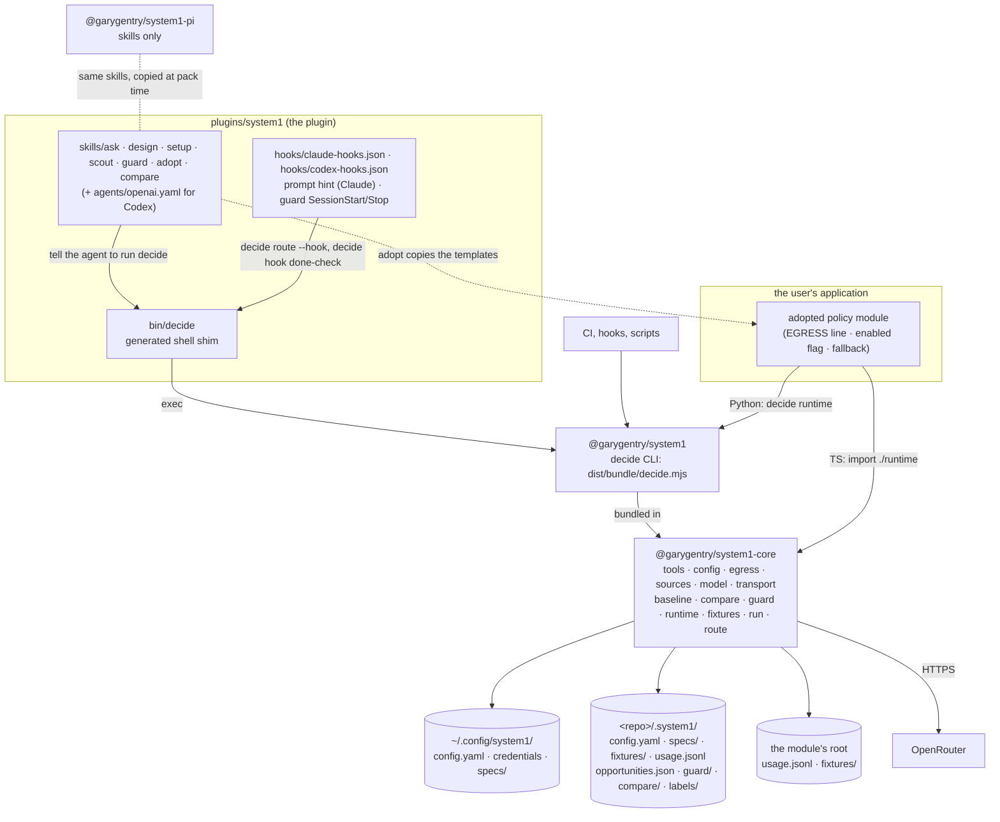

# Containers: plugin, CLI, engine, adopted code, local state

The deployable units, how each harness and an adopted module reach the engine, and where state
lives on disk. This replaces the diagram and harness matrix in
[ROADMAP § Architecture](../../plans/ROADMAP.md#architecture), which still show deferred pieces
(plugin `specs/`, agents) and predate guard and adopt.

```mermaid
flowchart TB
    subgraph plugin["plugins/system1 (the plugin)"]
        skills["skills/ask · design · setup · scout · guard · adopt · compare<br/>(+ agents/openai.yaml for Codex)"]
        shim["bin/decide<br/>generated shell shim"]
        hook["hooks/claude-hooks.json · hooks/codex-hooks.json<br/>prompt hint (Claude) · guard SessionStart/Stop"]
    end
    subgraph app["the user's application"]
        policy["adopted policy module<br/>(EGRESS line · enabled flag · fallback)"]
    end
    pipkg["@garygentry/system1-pi<br/>skills only"]
    cli["@garygentry/system1<br/>decide CLI: dist/bundle/decide.mjs"]
    core["@garygentry/system1-core<br/>tools · config · egress · sources · model · transport<br/>baseline · compare · guard · runtime · fixtures · run · route"]
    userdir[("~/.config/system1/<br/>config.yaml · credentials · specs/")]
    repodir[("&lt;repo&gt;/.system1/<br/>config.yaml · specs/ · fixtures/ · usage.jsonl<br/>opportunities.json · guard/ · compare/ · labels/")]
    approot[("the module's root<br/>usage.jsonl · fixtures/")]
    openrouter["OpenRouter"]
    scripts["CI, hooks, scripts"]

    skills -- "tell the agent to run decide" --> shim
    hook -- "decide route --hook, decide hook done-check" --> shim
    pipkg -. "same skills, copied at pack time" .- skills
    shim -- "exec" --> cli
    scripts --> cli
    cli -- "bundled in" --> core
    policy -- "TS: import ./runtime" --> core
    policy -- "Python: decide runtime" --> cli
    skills -. "adopt copies the templates" .-> policy
    core --> userdir
    core --> repodir
    core --> approot
    core -- "HTTPS" --> openrouter
```

## The units

| Unit | Source | What it is |
|---|---|---|
| The plugin | `plugins/system1/` | Seven skills, the generated manifests (`.claude-plugin/plugin.json`, `.codex-plugin/plugin.json`; no root `plugin.json`), the `bin/decide` shim and two hook files, `hooks/claude-hooks.json` and `hooks/codex-hooks.json`. Installed from the GitHub marketplaces, not from npm. |
| `@garygentry/system1` | `packages/cli` | The `decide` CLI. It ships only `dist/bundle/` (esbuild output with the engine inlined) and `THIRD-PARTY-NOTICES.md`; core is a devDependency. |
| `@garygentry/system1-core` | `packages/core` | The engine as a library. Published beside the CLI (M6 D1), with `index.ts` as its surface and six deep exports (`packages/core/package.json` `exports`). `./errors`, `./version`, `./route` and `./hook` keep the CLI's startup and hook paths off the barrel. `./runtime` is what adopted TypeScript imports, and `./runtime/grant` is the marked-line reader `decide runtime` uses. Only `./runtime` carries a stability promise (below); the barrel's is undecided. |
| `@garygentry/system1-pi` | `packages/pi` | Skills only, for `pi install npm:`. Its `package.json` and `prepack.mjs` are generated, and `prepack` copies `plugins/system1/skills` in. |

The seven skills are `ask` (hand a closed judgement to `decide`) and `design` (save a reusable
spec), which the model may load on its own, and five that are user-only:

- `setup`: install, key, consent, network;
- `scout`: screen code or agent configuration for decision-model opportunities into a backlog;
- `guard`: explain the guard packs and hand the user the line to enable one; it never enables a
  pack itself;
- `adopt`: turn a backlog entry into a policy module, a mapping, a shadow harness and offline tests,
  from the templates in `skills/adopt/references/templates/{ts,python}/`, and mark the entry
  `adopted` (`decide opportunities set-status`);
- `compare`: run `decide compare` over a capture and read the report.

None ships a spec to the lookup path: scout's two signal tables sit in its `references/` and are
passed to `--spec` by path. The lowest-priority spec directory (origin `bundled`) is set only by
`SYSTEM1_SPECS_PATH`; no package carries one.

## Per harness

What shipped, as generated by `tools/generate.ts` and verified in AGENTS.md's harness notes.

| | Claude Code | Codex | Pi |
|---|---|---|---|
| Manifest | `.claude-plugin/plugin.json` | `.codex-plugin/plugin.json` | root `package.json` `pi` key, or `@garygentry/system1-pi` |
| Marketplace | `.claude-plugin/marketplace.json` | `.agents/plugins/marketplace.json` | none: `pi install npm:@garygentry/system1-pi` or `git:` |
| Skills | `plugins/system1/skills/` | the same | the same, copied into the Pi package |
| User-only skills (`setup`, `scout`, `guard`, `adopt`, `compare`) | `disable-model-invocation: true` | `agents/openai.yaml` `allow_implicit_invocation: false` | `disable-model-invocation: true` |
| How `decide` is found | plugin `bin/` is on the Bash PATH, so the shim runs | not on PATH: `npm i -g @garygentry/system1` | not on PATH: `npm i -g @garygentry/system1` |
| Network from the shell | host sandbox settings, if sandboxing is on | `prefix_rule(pattern = ["decide"], decision = "allow")` in `$CODEX_HOME/rules/system1.rules`; covers commands that start with `decide`, not pipes into it | no sandbox |
| Hooks | `hooks/claude-hooks.json`: UserPromptSubmit ([0018](../../plans/decisions/0018-claude-routing-hook.md)), SessionStart and Stop (`decide hook done-check`) | `hooks/codex-hooks.json`: SessionStart and Stop, after the user trusts them | none |

`decide doctor` detects the harness (`packages/core/src/config/session.ts`) and prints the fix for
each gap, including the exact Codex rule (`CODEX_RULE` in `packages/core/src/tools/doctor.ts`).
The harnesses are unverified on macOS: [known gap 5](../../plans/ROADMAP.md#5-macos-is-unverified).

## Adopted code

A policy module that `adopt` writes is not part of any package: it is the user's code, in the
user's repo, and it runs wherever their application runs. It reaches the engine one of two ways.

| | TypeScript | Python |
|---|---|---|
| Template | `skills/adopt/references/templates/ts/policy.ts` | `skills/adopt/references/templates/python/policy.py` |
| Reaches the engine | imports `createPolicyRuntime` from `@garygentry/system1-core/runtime`, pinned to an exact version, and keeps one runtime per root and mode in the process | spawns `decide runtime --module <its own file> --root <dir> --max-usd-per-day <usd>` per call, request on stdin, one result on stdout (`packages/cli/src/commands/runtime.ts`) |
| The grant | its marked `EGRESS` line, passed as `egress`, and `module: import.meta.url`, so the runtime reads the same line from the file as a second lock (`packages/core/src/runtime/grant.ts`) | its marked `EGRESS` line, and `decide runtime` reads it from `--module` again |
| Needs at run time | the core package | Node 22 and a global `decide` speaking runtime protocol 1 (`RUNTIME_PROTOCOL`), else every call falls back with `engine-unavailable` |

Each module ships with a mapping (the existing mechanism's output in the question set's answer
space), a shadow harness that writes the capture `compare` reads, and offline tests that replay the
spec's recorded fixtures and scan the module for any grant (`grants.ts` · `grants.py`). The module
is inert twice over: the app passes `enabled: true`, and the user switches `EGRESS` on in review.
How the runtime decides one call is in [runtime.md](runtime.md#one-policy-runtime-call); why the
grant is a line of code is [0020](../../plans/decisions/0020-runtime-consent-for-adopted-code.md).

The stability promise covers `./runtime` only: its exports are pinned by
`packages/core/src/runtime/index.test.ts`, and a breaking change needs a minor bump and a decision
record (0020 §2).

## Local state

Nothing is held in memory between `decide` calls. Everything that must survive lives in two
directories, plus a root an adopted module names.

| Where | Files | Written by |
|---|---|---|
| `$XDG_CONFIG_HOME/system1/` (default `~/.config/system1/`) | `config.yaml` (user layer), `credentials` (`openrouter_api_key`, must be mode 600), `specs/` | the user; the `setup` skill says where the key goes and in what format |
| `<repo>/.system1/` | `config.yaml` (repo layer: consent, `egress.allowProfiles` and `guard.packs.*.enabled` are read only here), `specs/`, `fixtures/<namespace>/<sha256>.json`, `usage.jsonl` | consent and allow-profile: `decide config egress …`; packs: `decide guard enable`; specs: the `design` skill; fixtures: `--record`; the ledger: every decision call |
| `<repo>/.system1/` (scout, guard) | `opportunities.json` (the backlog), `guard/state.json` (per session: base commit, criteria snapshot, last check), each with a `.lock` beside it while written | `decide opportunities add` and `set-status`; `decide hook done-check` |
| `<repo>/.system1/compare/<spec>/` | `captured.jsonl` (`{id, state, current?, output?, usage?, latencyMs?}`), `fixtures/` (compare's recorded answers, both sides), `report.json`, and `probe/` (states the `adopt` skill writes to try a question) | the shadow harness (user code); `decide compare`; `adopt` |
| `<repo>/.system1/labels/` | `<spec>.jsonl` (`{id, labels}`) | the user |
| the module's `root` | `usage.jsonl` (lines tagged `runtime`), `fixtures/<spec>/` | `createPolicyRuntime` / `decide runtime`; without a writable root, spend is counted in memory and every result says `ledger: "memory"` |

The repo root is the nearest directory up from the working directory that holds `.system1/` or
`.git`, else the working directory (`findRepoRoot` in `packages/core/src/config/load.ts`). The
runtime never walks up: its `root` is whatever the module passes. Fixtures are content-addressed
(`packages/core/src/fixtures/store.ts`). The spend ledger is append-only JSONL, one line per call,
replays included at zero cost, with a `tag` on calls that are summed apart: `guard:done-check`,
`compare` and `runtime` (`packages/core/src/run/spend.ts`). Specs resolve repo first, then user,
then bundled (`packages/core/src/spec/spec.ts`). The guard state and the backlog are written under
a lock that a crashed writer can't hold forever (`withFileLock` in `packages/core/src/store/file.ts`).
`.system1/compare/` holds raw inputs; the `setup` skill suggests ignoring it, and doctor's
`captured` check warns when git doesn't.

## Rules the shape enforces

- **Skills never call HTTP.** They describe intent and tell the agent to run `decide`; the only
  code that sends content to the provider is `packages/core/src/transport/post.ts`, through the
  decisions transport (`transport/openrouter.ts`) or the baseline client (`baseline/client.ts`).
  See [AGENTS.md § Rules](../../AGENTS.md#rules).
- **Skills never run `decide runtime`.** Only an adopted Python module spawns it; `tools/validate.ts`
  refuses it in any skill file outside adopt's `references/templates/`.
- **The CLI is a thin adapter.** `packages/cli/src/commands/*` parse argv into a tool input and
  format the result. Each tool (input schema and handler) lives once in `packages/core/src/tools/`.
- **No MCP server and no Pi extension**
  ([0013](../../plans/decisions/0013-cli-first-mcp-deferred.md)). Because the tools don't depend
  on a harness, either could be added later as a second thin adapter.
- **No subagents.** Fan-out is `decide many`, which every harness can run
  ([0017](../../plans/decisions/0017-fan-out-through-the-cli-not-subagents.md)).
