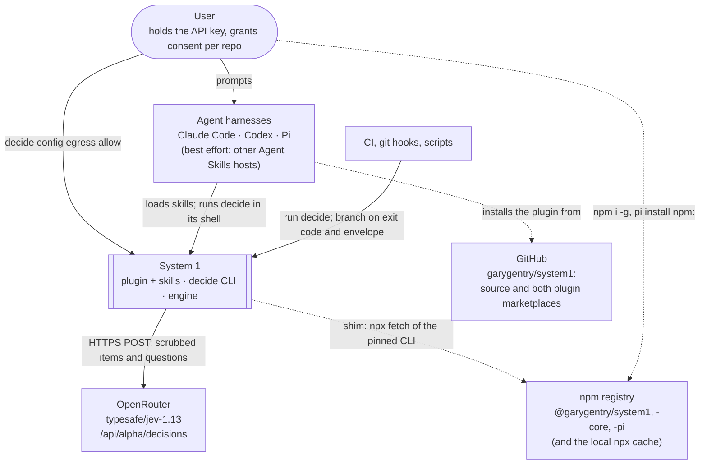

# System context

System 1 as one box among the people and systems it touches. The next level down is
[containers.md](containers.md).

## The actors

- **The user** owns two things nothing else may grant: the API key (`OPENROUTER_API_KEY`, or
  `~/.config/system1/credentials`) and egress consent, which is per repo and written only by
  `decide config egress allow`. See [crosscutting.md](crosscutting.md#egress).
- **Agent harnesses.** Claude Code, Codex and Pi are first-class, and other Agent Skills hosts are
  best effort (`plugins/system1/plugin.json` is the portable manifest for them). The harness loads
  the skills in `plugins/system1/skills/` and runs `decide` in its shell. How each one finds
  `decide` differs; see [containers.md](containers.md#per-harness).
- **CI, git hooks and scripts** call `decide` directly. The contract they rely on is one JSON
  envelope and a fixed exit code per error class
  ([0015](../../plans/decisions/0015-cli-contract-v1.md)).

## The external systems

- **OpenRouter** serves the only model profile, `typesafe/jev-1.13`
  (`packages/core/src/model/profiles.ts`), at `https://openrouter.ai/api/alpha/decisions`
  (`packages/core/src/transport/openrouter.ts`). That POST is the only call that carries content.
  `decide ping` and doctor's `network` check also make a keyless GET to the public model listing
  (`packages/core/src/ping.ts`), which sends no content. There is one model and one vendor:
  [known gap 4](../../plans/ROADMAP.md#4-one-model-one-vendor).
- **The npm registry** holds the three published packages. The plugin shim can run
  `npx @garygentry/system1@<version>` when no CLI is installed, and since 0.3.1 it first reuses a
  copy already in npx's cache (`plugins/system1/bin/decide`; see
  [deployment.md](deployment.md#how-the-shim-resolves-decide)).
- **GitHub** hosts the source and both marketplaces: `.claude-plugin/marketplace.json` for Claude
  Code and `.agents/plugins/marketplace.json` for Codex. Pi can also install from the repo through
  the root `package.json` `pi` key.

## What is not in the picture

There is no MCP server, no daemon and no hosted service: every `decide` call is a fresh process
([0013](../../plans/decisions/0013-cli-first-mcp-deferred.md)). The Claude prompt hook sends
nothing anywhere; it matches the prompt locally ([runtime.md](runtime.md#the-claude-prompt-hook)).
