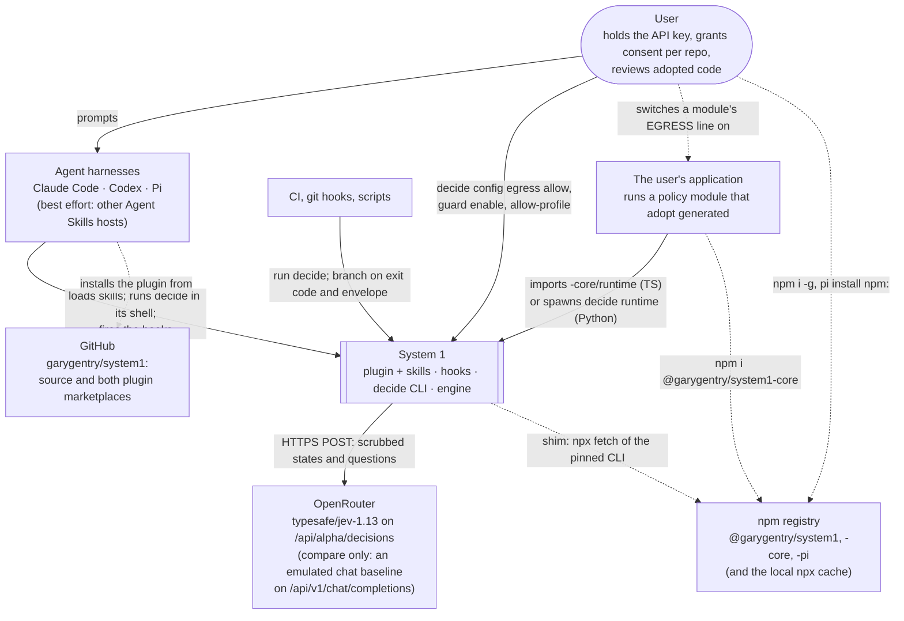

# System context

System 1 as one box among the people and systems it touches. The next level down is
[containers.md](containers.md).

```mermaid
flowchart TB
    user(["User<br/>holds the API key, grants consent per repo,<br/>reviews adopted code"])
    harness["Agent harnesses<br/>Claude Code · Codex · Pi<br/>(best effort: other Agent Skills hosts)"]
    scripts["CI, git hooks, scripts"]
    app["The user's application<br/>runs a policy module that adopt generated"]
    s1[["System 1<br/>plugin + skills · hooks · decide CLI · engine"]]
    openrouter["OpenRouter<br/>typesafe/jev-1.13 on /api/alpha/decisions<br/>(compare only: an emulated chat baseline<br/>on /api/v1/chat/completions)"]
    npm["npm registry<br/>@garygentry/system1, -core, -pi<br/>(and the local npx cache)"]
    github["GitHub<br/>garygentry/system1:<br/>source and both plugin marketplaces"]

    user -- "prompts" --> harness
    user -- "decide config egress allow,<br/>guard enable, allow-profile" --> s1
    user -. "switches a module's EGRESS line on" .-> app
    harness -- "loads skills; runs decide in its shell;<br/>fires the hooks" --> s1
    scripts -- "run decide; branch on exit code and envelope" --> s1
    app -- "imports -core/runtime (TS)<br/>or spawns decide runtime (Python)" --> s1
    s1 -- "HTTPS POST: scrubbed states and questions" --> openrouter
    s1 -. "shim: npx fetch of the pinned CLI" .-> npm
    app -. "npm i @garygentry/system1-core" .-> npm
    harness -. "installs the plugin from" .-> github
    user -. "npm i -g, pi install npm:" .-> npm
```

## The actors

- **The user** owns what nothing else may grant: the API key (`OPENROUTER_API_KEY`, or
  `~/.config/system1/credentials`) and egress consent, which is per repo and written only by
  `decide config egress allow`. Two further opt-ins sit on top of consent and are the user's too:
  enabling a guard pack (`decide guard enable`) and allowing an emulated baseline to receive the
  repo's content (`decide config egress allow-profile`). For adopted code the grant is a line of
  code the user switches on in review ([0020](../../plans/decisions/0020-runtime-consent-for-adopted-code.md)).
  See [crosscutting.md](crosscutting.md#egress).
- **Agent harnesses.** Claude Code, Codex and Pi are first-class, and other Agent Skills hosts are
  best effort: they get the skills at the plugin root. There is no root Agent Plugins `plugin.json`, because Codex then ignores the plugin's hooks (0007). The harness loads
  the skills in `plugins/system1/skills/` and runs `decide` in its shell. How each one finds
  `decide` differs; see [containers.md](containers.md#per-harness).
- **CI, git hooks and scripts** call `decide` directly. The contract they rely on is one JSON
  envelope and a fixed exit code per error class
  ([0015](../../plans/decisions/0015-cli-contract-v1.md)).
- **The user's application** (new in 0.6.0) runs a policy module that the `adopt` skill wrote into
  the repo from `plugins/system1/skills/adopt/references/templates/`. A TypeScript module imports
  `@garygentry/system1-core/runtime`; a Python one spawns `decide runtime` once per call. Either
  way the app keeps its existing mechanism and falls back to it with a reason code whenever the
  model doesn't answer. Unlike every other actor, it runs outside a harness, possibly in a deployed
  image with no repo config ([containers.md](containers.md#adopted-code)).

## The external systems

- **OpenRouter** serves the only decision model, `typesafe/jev-1.13`
  (`packages/core/src/model/profiles.ts`), at `https://openrouter.ai/api/alpha/decisions`
  (`packages/core/src/transport/openrouter.ts`). `decide compare` can also ask an *emulated*
  baseline, `emulated:anthropic/claude-haiku-4.5`, a chat model at
  `https://openrouter.ai/api/v1/chat/completions` (`packages/core/src/baseline/client.ts`), with
  `provider.data_collection: "deny"`. Those two POSTs, which share
  `packages/core/src/transport/post.ts`, are the only calls that carry content.
  `decide ping` and doctor's `network` check also make a keyless GET to the public model listing
  (`packages/core/src/ping.ts`), which sends no content. There is one model and one vendor:
  [known gap 4](../../plans/ROADMAP.md#4-one-model-one-vendor).
- **The npm registry** holds the three published packages. The plugin shim can run
  `npx @garygentry/system1@<version>` when no CLI is installed, and since 0.3.1 it first reuses a
  copy already in npx's cache (`plugins/system1/bin/decide`; see
  [deployment.md](deployment.md#how-the-shim-resolves-decide)).
- **GitHub** hosts the source and both marketplaces: `.claude-plugin/marketplace.json` for Claude
  Code and `.agents/plugins/marketplace.json` for Codex. Pi can also install from the repo through
  the root `package.json` `pi` key.

## What is not in the picture

There is no MCP server, no daemon and no hosted service: every `decide` call is a fresh process
([0013](../../plans/decisions/0013-cli-first-mcp-deferred.md)). The only long-lived process is the
user's own application, which holds a policy runtime in memory. The Claude prompt hook sends
nothing anywhere; it matches the prompt locally ([runtime.md](runtime.md#the-claude-prompt-hook)).
The guard Stop hooks send only in a repo that has consent and has enabled the pack
([runtime.md](runtime.md#the-guard-hooks)).
