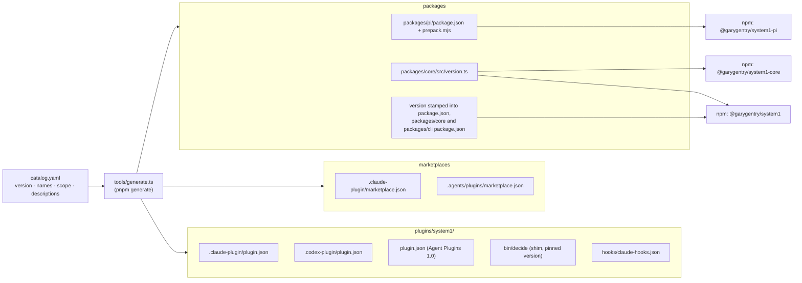

# Build, generation and release

How one catalog becomes three npm packages, two marketplaces and a shim, how the shim picks which
CLI to run, and what CI checks. The step-by-step release is
[../contributing/release.md](../contributing/release.md).

## `catalog.yaml` → `tools/generate.ts` → generated files

`catalog.yaml` holds the names, the version, the npm scope and the plugin's descriptions. Everything
derived from it is written by `tools/generate.ts` and marked `GENERATED — DO NOT EDIT` where the
format allows a comment.

- **Never edit a generated file.** Change `catalog.yaml` or the generator and run `pnpm generate`
  ([AGENTS.md § Rules](../../AGENTS.md#rules)).
- **`pnpm generate:check`** renders everything in memory and fails if any file on disk differs. It
  is part of `pnpm check`, so CI catches a hand edit or a forgotten regeneration.
  `tools/validate.test.ts` also checks that generation is deterministic and that the shim pins the
  catalog's version.
- **`pnpm validate`** (`tools/validate.ts`) checks skill frontmatter, version lockstep across every
  manifest, that each package's `repository.url` is the exact form npm trusted publishing matches
  on (the generator stamps it), the Agent Plugins required fields, and runs `claude plugin validate --strict` when
  `claude` is on PATH. CI has no `claude`, so run it locally before a release.
- **The Pi package's `skills/`** is not committed. Its generated `prepack.mjs` copies
  `plugins/system1/skills` in when the package is packed.
- **The version reaches runtime** through `packages/core/src/version.ts` (`VERSION` and
  `CLI_PACKAGE`), which `decide version`, `doctor` and the help text read.

## The bundle

`packages/cli/bundle.mjs` runs esbuild over `src/entry.ts` into `dist/bundle/decide.mjs` plus
split chunks in `dist/bundle/chunks/`. The engine and its runtime dependencies (`picomatch`,
`tinyglobby`, `typebox`, `yaml`) are inlined, so the published CLI has no runtime dependencies.
Details that matter:

- **Code splitting keeps startup low.** `main.ts` imports each command with a dynamic `import()`,
  and each command becomes its own chunk, so `decide version`, `help` and the hook's
  `route --hook` load only what they need. `entry.ts` also turns on Node's compile cache.
- **The build swaps in atomically.** It writes `dist/bundle.next` and renames it over
  `dist/bundle`, because the shim in a checkout runs that bundle and a concurrent `decide` must
  never find it missing.
- **Licence notices travel with it.** `tools/notices.mjs` writes
  `packages/cli/THIRD-PARTY-NOTICES.md` from the inlined packages; `pnpm check` fails if it is
  stale.
- **The startup target** is under 150 ms of overhead over bare `node -e 0` for `decide version`,
  `decide help` and `decide route --hook`, measured by `pnpm bench:startup`
  ([0013](../../plans/decisions/0013-cli-first-mcp-deferred.md), [quality.md](quality.md#live-and-local)).

`pnpm build` runs `tsc -b` for both packages, then the bundle.

## How the shim resolves `decide`

`plugins/system1/bin/decide` is a POSIX shell script, generated with the plugin's version pinned in
it. Claude Code puts it on the Bash PATH; the hook calls it by path. It runs the first of these
that exists:

1. **`SYSTEM1_CLI`**, if set: `node "$SYSTEM1_CLI"`. For testing a specific build.
2. **The checkout bundle**, `../../../packages/cli/dist/bundle/decide.mjs` relative to the shim,
   after resolving symlinks. This is what `claude --plugin-dir plugins/system1` (as smoke runs it)
   and the routing evals get, so they never exercise the published package.
3. **A real install on PATH.** Each `decide` on PATH is skipped if it sits in the shim's own
   directory, if it is another copy of the shim (it carries a marker line), or if its resolved path
   is not inside `@garygentry/system1/`. So an unrelated `decide` executable never stands in for
   the pinned CLI. The shim does not check that install's version; `decide doctor`'s
   `path-version` check warns when the `decide` on PATH differs from the CLI running doctor.
4. **The pinned version in npx's cache** (added in 0.3.1, commit `9aeecac`): the first
   `_npx/*/node_modules/@garygentry/system1` under `$npm_config_cache` (default `~/.npm`) whose
   `package.json` has exactly the pinned version, run with `node`. This never downloads, and it
   skips npx's own startup and registry check.
5. **`npx --yes @garygentry/system1@<version>`**, unless `SYSTEM1_NO_NPX` is set. This is how a
   plugin-only Claude install gets a CLI on first use.
6. Otherwise it prints the `npm i -g` command to stderr and exits 127.

`SYSTEM1_NO_NPX` is set by the Claude hook, so a prompt never waits on a download, and by
`decide doctor` when it probes which version PATH resolves to. Step 4 is why 0.3.1 exists: under
`SYSTEM1_NO_NPX`, a plugin-only install used to reach step 6, so the hook was silent. See
[runtime.md](runtime.md#the-claude-prompt-hook). `tools/shim.test.ts` covers the cache lookup.

Codex and Pi don't put plugin `bin/` on PATH, so their users install the CLI globally and the
shim is not involved ([containers.md](containers.md#per-harness)). In Claude Code the recommended
install is also global plus plugin ([0021](../../plans/decisions/0021-decide-is-the-product-one-repo-two-layers.md)):
the shim then resolves at step 3, and steps 4–5 are the fallback for a plugin-only install.

## CI

`.github/workflows/ci.yml` runs on every push to `main` and every pull request.

| Job | Matrix | Runs |
|---|---|---|
| `check` | `ubuntu-latest`, `macos-latest` × Node 22, 24 | `pnpm install --frozen-lockfile`, then `pnpm check` |
| `packed` | `ubuntu-latest`, `macos-latest`, Node from `.nvmrc` (22) | `pnpm release:check` |

Ruleset 23977751 requires these six checks by name (`check (ubuntu-latest, 22)` and so on) before a
pull request can merge. Changing the `ci.yml` matrix? Update the ruleset's required checks too, or
merges stall.

`pnpm check` is build, typecheck, lint, test, `generate:check`, `validate` and the notices check;
[quality.md](quality.md#always-offline) lists what each covers.

`pnpm release:check` (`tools/release-check.mjs`) exercises the artifact that would ship, with no
network and no registry. It builds, packs all three packages with `npm pack`, installs the CLI
tarball into a scratch prefix, and then checks that the installed CLI:

- reports the version in `packages/cli/package.json`;
- runs `decide doctor` offline in a fresh git repo;
- replays a `many` run over `tools/smoke/fixture-repo` (`1 kept of 3`);
- answers the routing hook: hints a done-check and stays quiet on a rename;
- replays an adopted cookbook recipe (`ci-failure`) through `decide spec check`.

It also checks that the CLI tarball carries `THIRD-PARTY-NOTICES.md` and that the Pi tarball holds
at least three `SKILL.md` files. On failure it keeps the scratch directory and prints its path.

### Release workflow

`.github/workflows/release.yml` runs on a pushed `vX.Y.Z` tag and stages the release on npm; a
maintainer approves it with npm 2FA ([0022](../../plans/decisions/0022-ci-publish-trusted-staged.md),
steps in [release.md](../contributing/release.md#4-ci-stages-the-release)).

| Job | Permissions | Runs |
|---|---|---|
| `verify` | `contents: read` | `tools/release-verify.mjs` (tag = version, signed by `.github/allowed_signers` on `main`, builds on `main`, not yet on npm), `pnpm check`, `pnpm release:check` |
| `stage` | `contents: read`, `id-token: write`; environment `npm-publish` | `tools/release-publish.mjs --stage --skip-check`: `npm stage publish` per package through npm trusted publishing (OIDC), Node 24, pinned npm 11 |

npm trusts the workflow by its file name, the repository and the environment, and only to stage.
No npm token is stored anywhere. Every action in both workflows is pinned to a commit SHA;
`.github/dependabot.yml` proposes updates weekly.

What CI does not cover: approving a release (that is the maintainer's npm 2FA), the harnesses
themselves (smoke and the routing evals are local only, and smoke needs GNU `timeout`), and live
calls.
